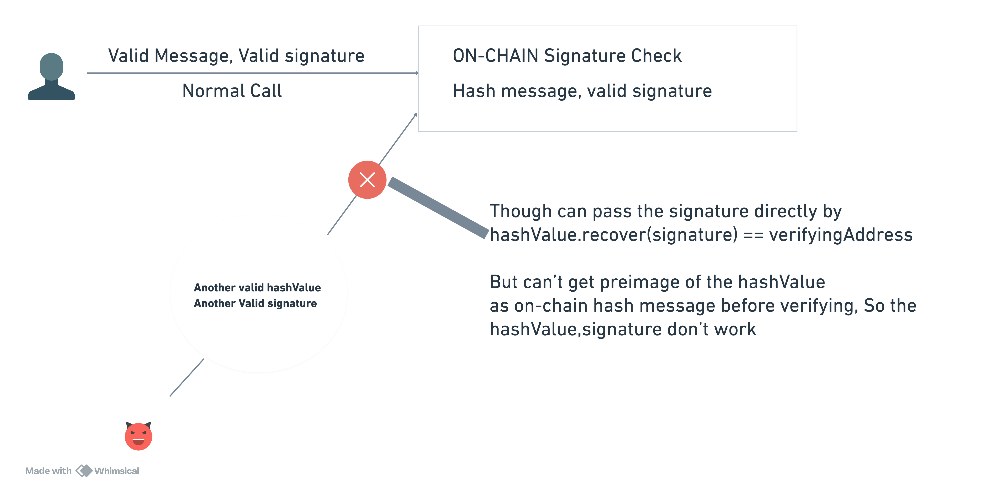

## Why should hash the message on-chain?

- As the feature of the hash function, one can't get the preimage by the hash value.

* Attacker can get another valid hashValue and signature by the public key, which can get by the corresponding's address's tx on-chain.
* So if the attacker want to use the another valid msg and signature on-chain while the on-chain hashing the message. Must get the preimage of the hashValue.
* As we know, one can't get the preimage by the hash value, So though the attack can generate another valid msg and signature, can't pass the on-chain hashing function.

