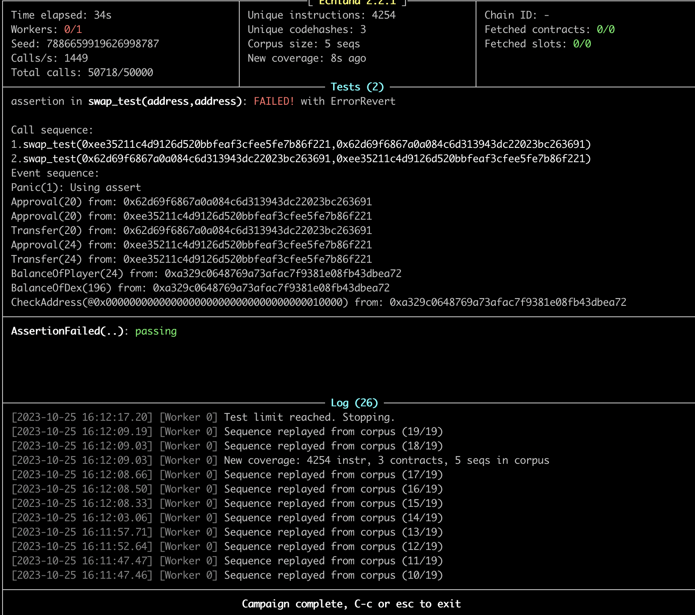
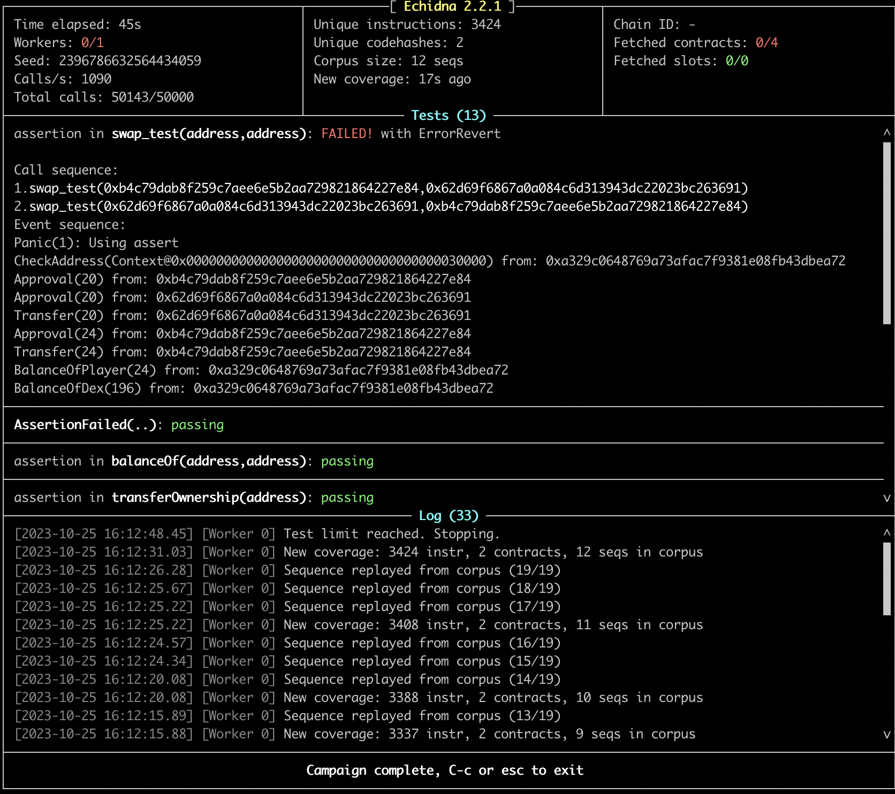

##  The problem trying to solve
[DEX 1 from Caputre the Ether](https://ethernaut.openzeppelin.com/level/22)

## The methods trying to use by echidna

* There are two method try to use, one is external echidna test which the play is the setupContract itself, Another is the internal echidna test which  the play is the echidna EOA address. more details can show in the below solution.

1. [SetupContract_external](https://github.com/sodexx7/security_related/blob/main/Echidna_Dex1/contracts/SetupContract_external.sol)

2. [SetupContract_internal](https://github.com/sodexx7/security_related/blob/main/Echidna_Dex1/contracts/SetupContract_internal.sol)

## Some points 

1.  Deploying  the setupContract like the ethernaut do

2.  add `require( (from == instance.token1() && to == instance.token2()) || (from == instance.token2() && to == instance.token1()));` to make sure the swap funtion only test the valid address, which can limit the unnecessary executions.

3.  The setupContract  will transferOwnership to make sure the play has no ownership

4.  Echidna uses what addresses as msg.sender by default? How many are needed? Can we speed up the fuzzing by changing this number?
    
    * Echidna use address(Ox30000) when setup the contract, while test the funciton, the default sender includes `["0x10000", "0x20000", "0x30000"]`.
    * If applied the internal method, just one sender is enough. make the sender as the player and directly using the player while testing.
    * If applied the external method, the echidna sender only as the trigger sender to make the smart contract player testing. So also one sender is enough.

5. [corpus](Echidna_Dex1/corpus) store which funciton have been tested, which funciton are not tested, such as the transferOwnership(because the player is not the owner)
   
## Test logic and results

1. My test logic
* Make sure the token1 and token2 in dex pool are same after execting the swap funciton, if the pools's token decrease, show the messages. 
* Firstly just make the amount can be arbitrary number, but no effective result, then change the player's balance of from token. The result as show below.
* Which shows swap(from,to,amount) then swap(to,from,amount) can decrease the pool's token. but seems there are still not fully hack the puzzle.
* My question is are there exist more effective way to hack it by using echidna..

2. Test results
* **Extermal Test**

* **Internal test**

