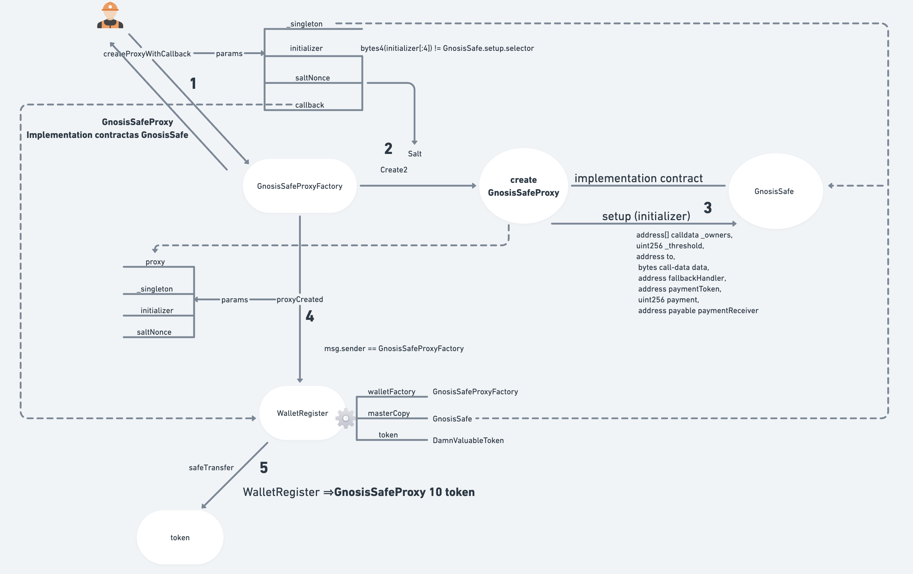
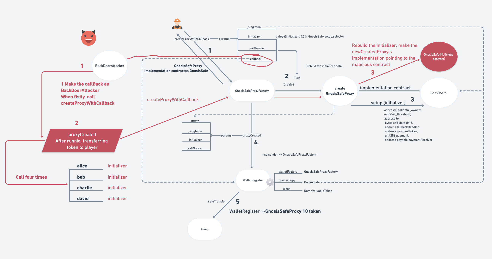
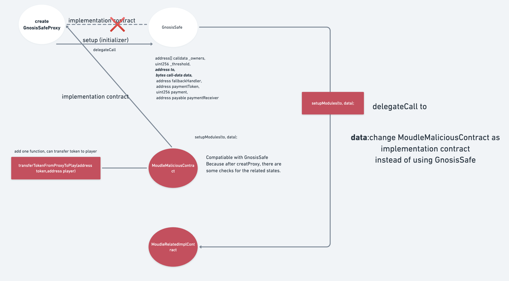

### Business logic



- This protocol's goal is create GnosisSafe by using WalletRegistry and only these Beneficiaries can be the owner of their corrospending's GnosisSafe owner.
  - GnosisSafe's main feaute is can execute one transaction by using signature and can work when all the owners of this contract agreed achieving the threshold.

* It doesn't limit who can use this feature, but after completing all operations, the GnosisSafe owner must the corrospending beneficiaries adddress, and the token was transferred to the GnosisSafe contract.

* For this feature, It doesn't not directly call one funciton. The steps as below

  - Caller ==> GnosisSafeProxyFactory::createProxyWithCallback ===> created GnosisSafeProxy along with the implementation is GnosisSafe ==> WalletRegistry:proxyCreated(check the results are right, such as owner, threshold,the initial function is setup，if all ok transfer token to GnosisSafeProxy) **_*(as above diagram)*_**

* The places using proxy

  - The created conctract is GnosisSafeProxy, and its implementation is GnosisSafe.

  * During calling setup function in GnosisSafe,setupModules can delegat call to's function

  ```
    function setup(
        address[] calldata _owners,
        uint256 _threshold,
        address to,
        bytes calldata data,
        address fallbackHandler,
        address paymentToken,
        uint256 payment,
        address payable paymentReceiver
    ) external {
        ...
        // As setupOwners can only be called if the contract has not been initialized we don't need a check for setupModules
        setupModules(to, data);
        ...
    }

  ```

  ```
    function setupModules(address to, bytes memory data) internal {
        require(modules[SENTINEL_MODULES] == address(0), "GS100");
        modules[SENTINEL_MODULES] = SENTINEL_MODULES;
        if (to != address(0))
            // Setup has to complete successfully or transaction fails.
            require(execute(to, 0, data, Enum.Operation.DelegateCall, gasleft()), "GS000");
    }
  ```

### Attack steps



1. Deploy one contract(BackDoorAttacker) which should inherited IProxyCreationCallback, and take this contract address as callback when calling GnosisSafeProxyFactory::createProxyWithCallback.

2. Then after creating one Proxy, the GnosisSafeProxyFactory will call BackDoorAttacker's proxyCreated function.

3. Then we can rebuild the calldata, calling the GnosisSafeProxyFactory::createProxyWithCallback four times based on different beneficiaries.

- new calldata as below

* `_gnosisSafeProxyFactory.createProxyWithCallback(singleton, userBytes, i, _walletRegistry);`
* singleton keep same
* i salit
* userBytes, based on the different beneficiaries
* walletRegistry, the corrent walletRegistry address

4. For the userBytes.
   — after creating Proxy with setting the gnoissSafe as its implementation, can caling setupModules, changing the implementation as a malicoious contract

 

- As above shows, using the malicous userbytes,after executing the setup, the proxy's implementation contract was changed as MoudleMaliciousContract, which includes the funtion can transfer token to player. So now calling Proxy that will use the MoudleMaliciousContract code.

5. Afer calling GnosisSafeProxyFactory::createProxyWithCallback, will return the proxy address, then directly call proxy address by using the MoudleMaliciousContract function(transferTokenFromProxyToPlay(address token,address player)).
